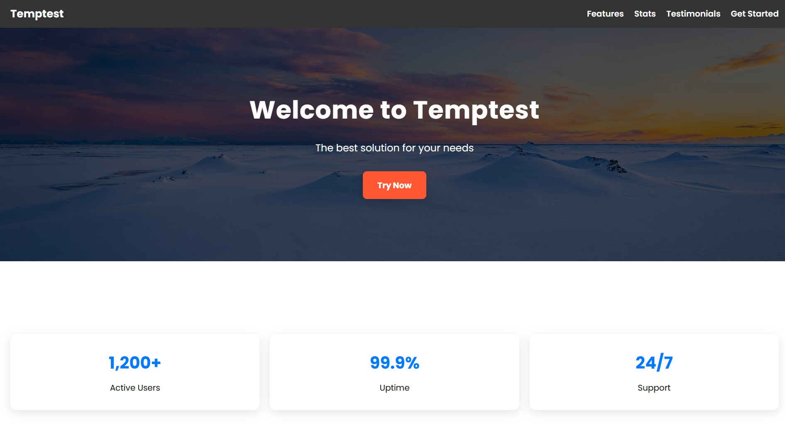

# CodeClauseInternship_ResponsiveLandingPage
Responsive Landing Page project for CodeClause Web Development Internship, built with HTML and CSS.

# Responsive Landing Page

## Project Overview
This is a **responsive landing page** project created for the **CodeClause Web Development Internship**.  
The page is designed to showcase a product/service with sections for **features, testimonials, and a call-to-action**.

---

## Features
- Fully responsive design (works on desktop, tablet, and mobile).  
- Hero section with background image.  
- Features section highlighting product advantages.  
- Testimonials section with user feedback.  
- Call-to-action section for user engagement.  
- Clean and modern UI using HTML and CSS.

---

## Technologies Used
- HTML  
- CSS  
- Responsive Design (Media Queries)  

---

## Demo
  

> Replace with your own screenshot if you like.

---

## Author
- **Your Name**  
- Web Development Intern at **CodeClause**  
- GitHub: [YourGitHubProfile](https://github.com/yourusername)
